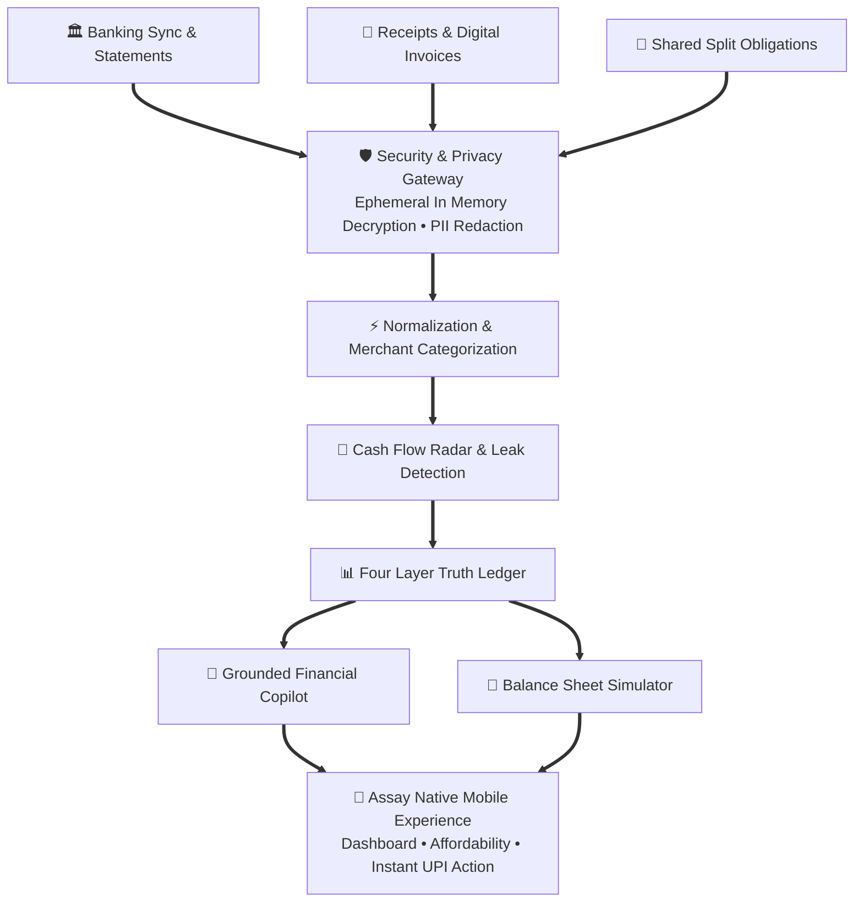

<div align="center">

# 🏛️ ASSAY
### Autonomous Financial Health Intelligence Copilot

<p align="center">
  <b>Understand your money with quiet clarity.</b><br>
  A mobile first financial copilot that converts raw financial history into verified, explainable actions.
</p>

<p align="center">
  
  
  
  
  
</p>

</div>

___

## 💡 The Philosophy

Most personal finance tools act as passive rear view mirrors. They generate colorful pie charts of past expenses without providing clarity on future liquidity, runway safety, or actionable financial decisions.

Assay is engineered as a quiet, institutional grade financial intelligence system. It consolidates accounts, salary streams, fixed obligations, debt exposure, savings discipline, and liquidity patterns, classifying every metric into four verifiable layers of truth:

<table>
  <thead>
    <tr>
      <th>Layer</th>
      <th>Classification</th>
      <th>Definition</th>
    </tr>
  </thead>
  <tbody>
    <tr>
      <td><b>01</b></td>
      <td><b>Observed</b></td>
      <td>Directly verified facts grounded in primary records, bank statements, and confirmed transaction logs.</td>
    </tr>
    <tr>
      <td><b>02</b></td>
      <td><b>Predicted</b></td>
      <td>Statistical projections calculating month end liquidity runway, recurring liabilities, and obligation pressure.</td>
    </tr>
    <tr>
      <td><b>03</b></td>
      <td><b>Recommended</b></td>
      <td>Data backed financial optimizations prioritized by mathematical impact on net worth and cash durability.</td>
    </tr>
    <tr>
      <td><b>04</b></td>
      <td><b>Impact</b></td>
      <td>Deterministic balance sheet simulations revealing exact financial outcomes before committing capital.</td>
    </tr>
  </tbody>
</table>

> **Core Principle**: The Large Language Model explains structured calculations. It is never the source of truth for financial math.

___

## 🏗️ System Architecture

Assay follows a strictly layered, privacy first vertical architecture. Financial telemetry flows through dedicated security and normalization tiers into deterministic analytical engines before reaching the intelligence and presentation layers.



### Architectural Flow Breakdown

1. **Financial Ingestion**: Unifies multiple financial records including electronic account sync, digital statements, camera receipt captures, and manual group split records.
2. **Security and Privacy Gateway**: Processes all incoming financial payloads ephemerally in device RAM. Immediately redacts account numbers, personal identifiers, and metadata before domain processing.
3. **Deterministic Core Engine**: Normalizes transaction descriptions, matches merchants, detects subscription creep, and maintains the four layer truth ledger.
4. **Grounded Intelligence**: Formulates explainable natural language advice and executes balance sheet simulations backed by mathematical models.
5. **Mobile Experience & Execution**: Delivers fluid mobile screens with integrated settlement links and sovereign user consent controls.

___

## 📱 Mobile Experience Features

The mobile application provides comprehensive workflows built on top of Expo Router:

* **Financial Health Dashboard**: Real time liquidity overview, monthly cash burn rate, and verified net worth metrics.
* **Spending Analytics & Insights**: Granular categorizations breaking down essentials, commitments, discretionary leisure, and investments.
* **Transaction Audit Views**: Detailed transaction inspection with verified counterparty provenance and category tags.
* **Receipt & Invoice Ingestion**: On device camera capture and optical ingestion for bills, invoices, and payment receipts.
* **Conversational Financial Copilot**: Chat interface providing context aware financial advice grounded in actual balance sheet math.
* **Affordability Analysis Engine**: Evaluates whether upcoming discretionary purchases fit safely into projected month end cash runway.
* **Debt & Obligation Manager**: Tracks loan pressure, credit facilities, interest costs, and prepayment optimization schedules.
* **Smart Bill Split & Group Settlement**: Instant split allocation across multiple participants with integrated UPI deep links.
* **Interactive Scenario Simulator**: What if financial sandbox modeling interest savings, emergency fund safety, and income shifts.
* **Profile & Security Preferences**: Sovereign data controls, biometric authentication toggles, and personalized 3D identity selection.

___

## 🧠 Financial Health Intelligence

Assay implements a deterministic computational pipeline to ensure financial advice is grounded, verifiable, and free of hallucination:

* **Transaction Normalization**: Automated cleansing of ambiguous banking strings and merchant descriptor mapping.
* **Cash Flow Forecasting**: Statistical liquidity projections calculating safe to spend surplus and month end runway.
* **Recurring Leak Detection**: Identifies silent recurring debits, forgotten trials, and subscription price increases.
* **Data Backed Recommendations**: Generates prioritised financial actions based on observed balances rather than generic advice.
* **Recommendation Impact Simulation**: Deterministic balance sheet modeling showing numerical outcomes before you commit capital.
* **Explainable Copilot Reasoning**: The generative language model translates structured calculations into plain language with confidence metrics.
* **Provenance Tracking**: Every recommendation references the primary records that produced it for complete auditability.

___

## 🛠️ Technology Stack

<p align="center">
  
  
  
  
  
</p>

<table>
  <thead>
    <tr>
      <th>Domain</th>
      <th>Technology</th>
      <th>Purpose</th>
    </tr>
  </thead>
  <tbody>
    <tr>
      <td><b>Mobile Runtime</b></td>
      <td>Expo SDK 57 / React Native 0.86</td>
      <td>Native iOS and Android mobile runtime with React 19 and New Architecture enabled</td>
    </tr>
    <tr>
      <td><b>Application Routing</b></td>
      <td>Expo Router v54</td>
      <td>File based deep linked application navigation with type safe route definitions</td>
    </tr>
    <tr>
      <td><b>Language & Types</b></td>
      <td>TypeScript 6.0</td>
      <td>Strict end to end type safety, domain modeling, and compile time verification</td>
    </tr>
    <tr>
      <td><b>State & Data Layer</b></td>
      <td>TanStack React Query & Axios</td>
      <td>Declarative client caching, optimistic updates, and API orchestration</td>
    </tr>
    <tr>
      <td><b>Motion & Gestures</b></td>
      <td>React Native Reanimated 4.5 & Gesture Handler</td>
      <td>Hardware accelerated 60 FPS gesture driven physics and layout transitions</td>
    </tr>
    <tr>
      <td><b>Visual Aesthetics</b></td>
      <td>Expo Blur & React Native SVG</td>
      <td>Liquid glassmorphism, depth shaders, and sharp vector graphic rendering</td>
    </tr>
    <tr>
      <td><b>Typography Engine</b></td>
      <td>Antic Didone & DM Sans & Inter</td>
      <td>Editorial headings with modern geometric fintech figures</td>
    </tr>
    <tr>
      <td><b>Hardware Security</b></td>
      <td>Expo SecureStore (Keychain & KeyStore)</td>
      <td>Hardware backed KeyStore and Secure Enclave token persistence</td>
    </tr>
    <tr>
      <td><b>Native Device APIs</b></td>
      <td>Expo Image Picker & Expo Font</td>
      <td>Native photo selection, receipt capture, and synchronous font preloading</td>
    </tr>
  </tbody>
</table>

___

## 📁 Repository Structure

```text
Assay/
├── app/                        → Expo Router screen routes and navigation
│   ├── (tabs)/                 → Core tab navigation (Dashboard, Insights, Upload, Settings)
│   ├── ai/                     → Real time financial telemetry and insights hub
│   ├── auth/                   → Sovereign authentication and access security
│   ├── connect/                → Account connection and discovery flows
│   ├── copilot/                → Conversational financial intelligence screens
│   ├── debt/                   → Obligation analysis and loan tracking views
│   ├── settings/               → Profile management and security preferences
│   ├── simulator/              → Interactive financial impact modeling
│   ├── split/                  → Smart bill splitting and group settlement
│   └── transaction/            → Granular transaction audit details
├── assets/                     → Static production resources
│   ├── avatars/                → 35 bundled 3D Memoji profile assets
│   ├── fonts/                  → Antic Didone and DM Sans typefaces
│   └── logos/                  → Calibrated banking and merchant brand assets
├── components/                 → Reusable UI design system
│   ├── aa/                     → Account aggregator widgets and consent panels
│   ├── auth/                   → Authentication inputs and verification cards
│   ├── dashboard/              → Net worth metrics and liquidity runway cards
│   ├── profile/                → ProfileAvatar and identity management
│   ├── ui/                     → MerchantLogo, Card, Header, and TransactionRow
│   ├── Button.tsx              → Haptic enabled action button primitives
│   ├── Card.tsx                → Liquid glassmorphic card containers
│   └── Typography.tsx          → Strict semantic typography components
├── constants/                  → Centralized design tokens
│   ├── brandLogos.ts           → Brand logo mappings and fallbacks
│   ├── memojis.ts              → Local 3D Memoji asset registry
│   └── theme.ts                → Color palette, spacing, and elevation tokens
├── services/                   → Application services and state managers
│   ├── aaState.ts              → Account aggregator reactive session store
│   ├── api.ts                  → Authenticated HTTP client and interceptors
│   ├── auth.ts                 → Token management and session lifecycle
│   ├── avatarStorage.ts        → Reactive singleton profile state service
│   ├── transactions.ts         → Transaction fetching and cache management
│   └── upload.ts               → Receipt and document ingestion pipeline
├── types/                      → TypeScript domain models
│   ├── aa.ts                   → Account and financial domain models
│   ├── category.ts             → Merchant classification definitions
│   ├── receipt.ts              → Optical document ingestion types
│   ├── transaction.ts          → Ledger transaction schemas
│   └── user.ts                 → User account and security schemas
└── utils/                      → Currency, date, and mathematical helpers
    ├── currency.ts             → Precision monetary formatting routines
    ├── date.ts                 → Relative timestamps and ledger intervals
    └── parser.ts               → Financial document parsing utilities
```

___

## 🔒 Security, Privacy and Consent

Assay is engineered from the ground up to protect user data sovereignty and uphold the highest standards of financial confidentiality.

### 🛡️ Sovereign User Consent
* **Explicit Purpose Limitation**: Financial records are imported exclusively for personal balance sheet analysis and user requested advice.
* **Revocable Permissions**: Users maintain continuous control over all data connections and can pause sync or revoke access at any time.
* **Zero Secondary Monetization**: User financial records are never sold, rented, or utilized for advertising profiles.

### 🔐 In Memory Processing and Zero Plaintext Persistence
* **Ephemeral In Memory Handling**: Financial records and statement contents are processed directly in device memory during active sessions.
* **No Persistent Plaintext**: Raw unencrypted financial statements are never saved to unencrypted device disks or central databases.
* **No Banking Passwords**: Assay never collects, stores, or asks for NetBanking passwords, card PINs, or UPI passcodes.

### 🔍 On Device Processing and Local Computation
* **Client Side Calculations**: Normalization, categorizations, cash flow projections, and debt runway modeling execute locally on your physical device.
* **Bandwidth and Privacy Optimization**: By computing key financial metrics directly on device, unnecessary transmission of sensitive personal transaction records is eliminated.

### 🛡️ Automatic PII Redaction
* **Masked Identifiers**: Sensitive account numbers are automatically masked to the last four digits (for example, `•••• 4821`).
* **Scrubbed Metadata**: Personal names, phone numbers, email addresses, and government identifiers are scrubbed from display and analysis contexts.

### 🗝️ Hardware Enclave Cryptographic Storage
* **Hardware KeyStore Isolation**: Sensitive session tokens and local cryptographic keys are protected by the physical device hardware security enclave (iOS Keychain or Android KeyStore).
* **Biometric Access Controls**: Users can activate biometric protection (Face ID, Touch ID, or Android Biometric Prompt) to guard application entry and transaction audits.

### 🧠 Sandboxed Copilot Privacy Firewall
* **Context Sanitization Barrier**: The Copilot language model only receives generalized financial ratios (such as burn rate, liquidity runway, and category proportions). No raw statement lines or identifiers enter prompt contexts.
* **Read Only Advisory**: The Copilot operates strictly as an explanatory advisor with zero transaction capability and zero access to move capital.

### 🚫 Zero Tracking and Telemetry Isolation
* **Zero Marketing Trackers**: Assay contains no third party tracking SDKs, advertising beacons, or behavioral monitoring libraries.
* **Independent Visual Resources**: All merchant brand marks and profile assets are embedded directly into the application, eliminating external network tracking calls.

___

## 🚀 Getting Started

### Prerequisites
* Node.js version 18 or higher
* npm or yarn package manager
* Expo Go application on mobile or iOS Simulator / Android Emulator

### Installation

1. Clone the repository:
```bash
git clone https://github.com/AshrafGalaxy/Assay.git
cd Assay
```

2. Install dependencies:
```bash
npm install
```

3. Launch the local development server:
```bash
npm start
```

4. Choose your mobile target from the terminal:
* Press `a` to open in Android Emulator
* Press `i` to open in iOS Simulator
* Scan the displayed QR code with the Expo Go mobile app on your physical device

### Production Verification

To verify the TypeScript integrity and test compilation:

```bash
npx tsc
```

___

<div align="center">
  <p><b>Crafted for HackMatrix • Assay Financial Intelligence Copilot</b></p>
</div>