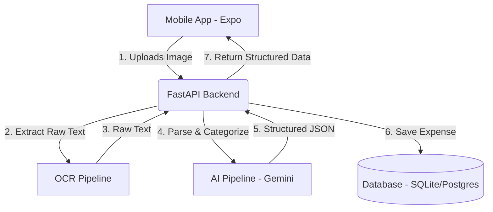

# Architecture Blueprint

## System Overview
Assay uses a client-server architecture designed for fast mobile interactions and heavy-lifting AI parsing on the backend. The frontend is built using React Native & Expo, communicating with a lightweight FastAPI backend which coordinates OCR and AI categorization models.



---

## App Flow
1. **Upload Trigger:** User snaps a photo of a receipt or selects a UPI screenshot.
2. **Local Preview:** Frontend displays a loading skeleton with optimistic UI updates.
3. **API Processing:** The image is sent to `/api/v1/expenses/upload`.
4. **Text Extraction:** Backend runs OCR to obtain text.
5. **AI Extraction:** Gemini processes the OCR text and structures it into JSON matching our schema.
6. **Confirmation:** The app presents the user with the pre-filled fields (Merchant, Date, Amount, Category) for confirmation or minor corrections.
7. **Persistence:** The approved transaction is saved to the database.

---

## Folder Structure
The workspace follows standard Expo and monorepo-ready guidelines:

```
assay/
├── app/                  # Expo Router tab layouts & screens
│   ├── (tabs)/           # Tabbed navigation (Dashboard, History, Upload, etc.)
│   ├── ai/               # AI chatbot interface
│   └── _layout.tsx       # Root layout, provider setup, and font loading
├── components/           # Reusable presentational & container components
│   ├── Card.tsx          # Card component supporting multiple variants
│   ├── Button.tsx        # Styled primary/secondary buttons
│   └── Typography.tsx    # Strict text styling wrapper using themed fonts
├── constants/            # Global constants (theme.ts, config.ts)
├── hooks/                # Custom React hooks (useAuth, useExpenses)
├── services/             # API client & backend service interfaces
├── types/                # TypeScript interfaces and type definitions
├── utils/                # Helper utility functions (formatters, validators)
└── docs/                 # Documentation directory
```

### Purpose of Key Folders:
* `app/`: Defines the file-system routing structure. Using directories like `(tabs)` groups related pages under a tab layout.
* `components/`: UI building blocks. Separating design components ensures visual consistency across the app.
* `services/`: Encapsulates all network request logic, preventing API-calling code from cluttering React hooks or screen files.
* `constants/`: Centralized tokens for styling (colors, sizes, fonts) to easily support customization or dark mode.

---

## Backend Architecture
The backend is planned as a Python-based **FastAPI** application due to its speed, automatic Swagger/OpenAPI documentation generation, and seamless integration with AI libraries.

* **API Router Layer:** Endpoints for `/auth`, `/expenses`, `/splits`, and `/analytics`.
* **Service Layer:** Business logic separation (e.g., OCR handler, Gemini prompt constructor).
* **Database Access Layer:** SQLAlchemy / SQLModel ORM for clean schema definitions and transactions.

---

## Frontend Architecture
The frontend is built on **Expo (React Native)** using TypeScript.

* **State Management:** React Query (`@tanstack/react-query`) for server-state caching, automatic refetching, and optimistic updates.
* **Navigation:** Expo Router (v4/File-based routing) utilizing safe area contexts and platform-native transitions.
* **Component Design:** Atom-based pattern (Typography -> Button/Card -> Layouts -> Screens).

---

## Database
We will utilize **PostgreSQL** (via Supabase or direct hosting) for production, and **SQLite** for local development.

* **Main Tables:** `users`, `expenses`, `receipt_metadata`, `splits`, `categories`.
* **Relationships:**
  * One-to-Many: `User -> Expenses`
  * One-to-Many: `Expense -> Splits`
  * Many-to-One: `Expense -> Category`

---

## API Flow

```
[Mobile App]                  [FastAPI]                    [Gemini API]
     │                            │                              │
     ├────── POST /upload ───────>│                              │
     │       (Image Data)         ├─────── Run OCR ───────┐      │
     │                            │                       │ (Extract Text)
     │                            │<──────────────────────┘      │
     │                            │                              │
     │                            ├──── prompt + OCR text ──────>│
     │                            │                              │
     │                            │<─── structured JSON ─────────┤
     │                            │                              │
     │<──── JSON response ────────┤                              │
     │                            │                              │
```

---

## OCR Pipeline
1. **Pre-processing:** Resize and grayscale image on the backend to increase OCR speed and accuracy.
2. **Text Engine:** Integrate Google Cloud Vision API (or Tesseract for local testing) to extract bounding boxes and text blocks.
3. **Structured Dump:** Aggregate raw text lines sequentially to preserve spatial layout for the AI parser.

---

## AI Pipeline
Rather than relying on brittle regex matching for text parser rules:
1. **Prompt Design:** Inject a strict JSON schema into the system prompt of Gemini (e.g., Gemini 2.5 Flash / 1.5 Flash).
2. **Context Delivery:** Pass the OCR-extracted text block as user input.
3. **JSON Output Mode:** Enforce `response_mime_type: "application/json"` to ensure structural compliance.
4. **Post-processing:** Clean and fallback defaults for missing fields (e.g., setting today's date if no date is found).

---

## Tech Stack
* **Frontend:** Expo v54, React Native 0.81, TypeScript, Lucide React Native (icons).
* **Backend:** FastAPI, Python 3.11+, Pydantic.
* **OCR & AI:** Gemini Developer API, Google Cloud Vision OCR.
* **Database:** PostgreSQL / SQLite.
* **Hosting:** Vercel/Fly.io (backend), Expo EAS (frontend).

---

## Deployment
* **CI/CD:** GitHub Actions to run tests, lint, and build.
* **EAS Build:** Expo Application Services for building Android `.apk`/`.aab` and iOS `.ipa` files.
* **Docker:** Package FastAPI into a container for scalable cloud deployment.
